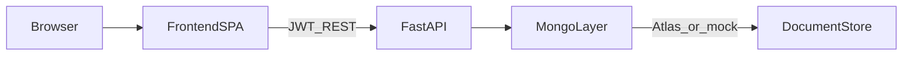

# Architecture Note

## What I Prioritized

I prioritized a strong end-to-end product slice over breadth:

1. A usable document editing flow with rich text, rename, autosave, and reopen.
2. A simple but real sharing model with ownership and recipient access.
3. File import that fits the product instead of a generic upload demo.
4. Reviewer-friendly setup and seeded accounts.

I intentionally did not build live multiplayer, comments, permissions tiers, or revision history because those features would have reduced the quality of the core document, sharing, and persistence experience inside the assignment timebox.

## System Design



## Frontend

The frontend is a React + Vite SPA with TypeScript and Zustand.

- `authStore` owns session state, JWT persistence, login/register actions, and logout behavior.
- `documentStore` owns owned/shared document lists, active document state, save status, sharing, and imports.
- React Router separates the auth screen, dashboard, and editor surface.
- Tiptap handles the rich-text editing layer with a limited, product-appropriate toolbar.

Why Zustand:

- Small API surface
- Easy async action management
- Minimal boilerplate for a timeboxed build

## Backend

The backend is a FastAPI service split into route, schema, service, and persistence modules.

- `auth.py` handles register, login, and `me`.
- `documents.py` handles list, create, fetch, update, and share.
- `uploads.py` handles `.txt` and `.md` imports.
- `document_service.py` centralizes access control and document mutation logic.

Why this split:

- Keeps route handlers thin
- Avoids duplicating access-control logic
- Makes the sharing test meaningful and easy to maintain

## Data Model

### Users

```json
{
  "_id": "ObjectId",
  "email": "ava@example.com",
  "name": "Ava Owner",
  "password_hash": "pbkdf2 hash",
  "created_at": "timestamp"
}
```

### Documents

```json
{
  "_id": "ObjectId",
  "owner_id": "ObjectId",
  "title": "Team kickoff notes",
  "content": { "type": "doc", "content": [] },
  "content_preview": "Plain text excerpt",
  "shared_with": [
    {
      "user_id": "ObjectId",
      "email": "ben@example.com",
      "granted_at": "timestamp"
    }
  ],
  "created_at": "timestamp",
  "updated_at": "timestamp"
}
```

## Persistence Choice

The durable target is MongoDB Atlas M0 because it is free, widely used, and appropriate for this assignment.

For local review convenience, I added a `mongomock://` fallback. That lets the project boot without immediate cloud setup, while Atlas remains the intended durable environment for deployment and persistent review.

## Rich Text Storage

I store editor content as Tiptap JSON instead of HTML.

Reasons:

- Better alignment with the editor’s native schema
- Easier preservation of headings, lists, and marks
- Lower risk of lossy round-tripping between formats

## Sharing Model

The sharing model is role-based:

- A single owner creates the document.
- Owners and editors can grant access to another registered user by email.
- Shared collaborators are assigned either `editor` or `viewer`.
- The UI shows owned and shared documents separately.
- Editors can update the document and reshare it.
- Viewers can open the document but cannot edit or share it.

This keeps the sharing model simple enough for the assignment while still demonstrating meaningful permission handling beyond a binary shared/not-shared flag.

## Validation And Error Handling

I added lightweight but meaningful safeguards:

- Duplicate email registration is rejected.
- Invalid login returns a clear error.
- Access to unshared documents is blocked.
- Only owners and editors can share or edit a document.
- Viewers are blocked from edits and reshares.
- Unsupported upload types are rejected.
- UTF-8 decoding errors are handled during imports.

## Tradeoffs

### Chosen

- Strong single-document editing flow over many secondary features
- Clear sharing/access model over broad permissions
- Importing text and Markdown over more complex formats like `.docx`

### Deferred

- Real-time collaboration
- Commenting
- Inline presence indicators
- Search
- Folder organization
- Revision history

## What I Would Build With Another 2-4 Hours

1. Add permission revocation and collaborator removal.
2. Split the Tiptap editor route into a lazy-loaded bundle to reduce the initial payload.
3. Add optimistic dashboard refresh after share/import actions.
4. Add a frontend integration test around the dashboard and auth redirect flow.
5. Complete cloud deployment and record the walkthrough with real hosted URLs.
